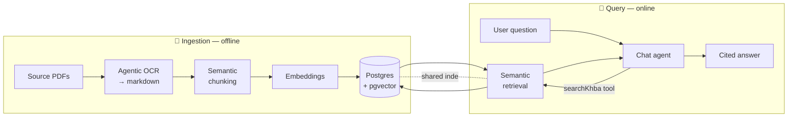
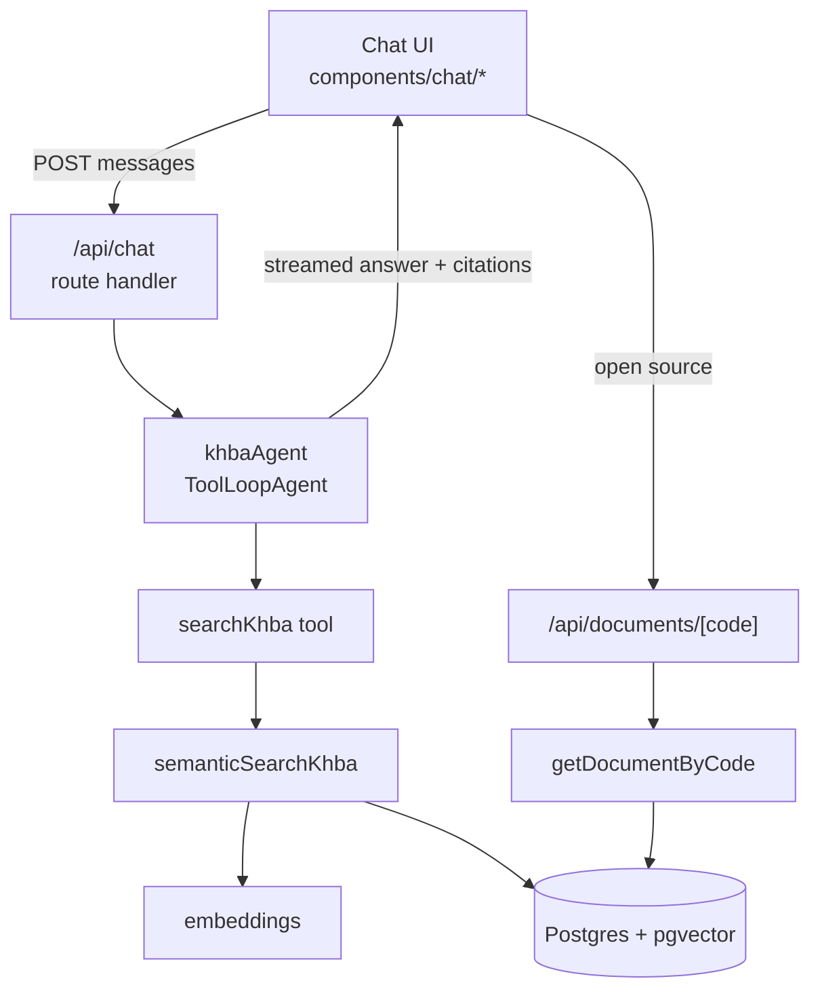
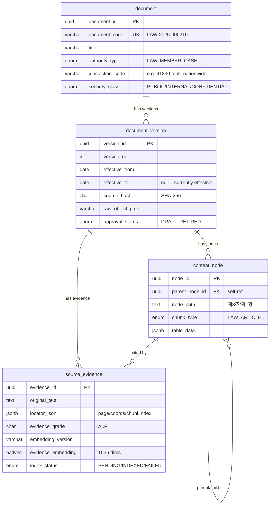
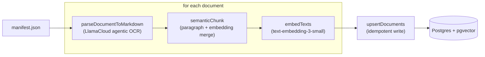
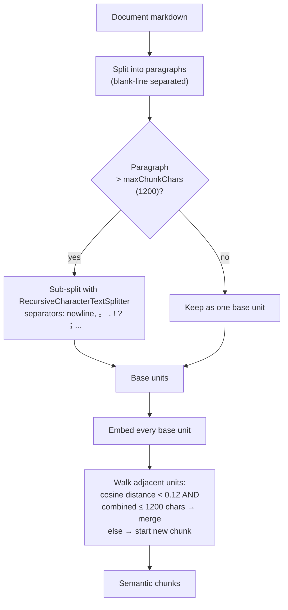
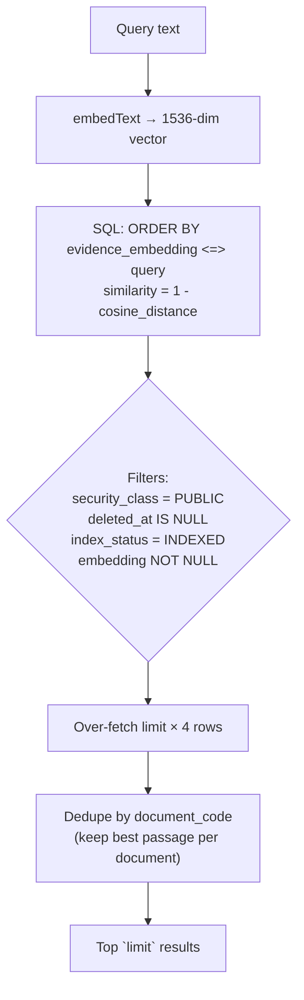
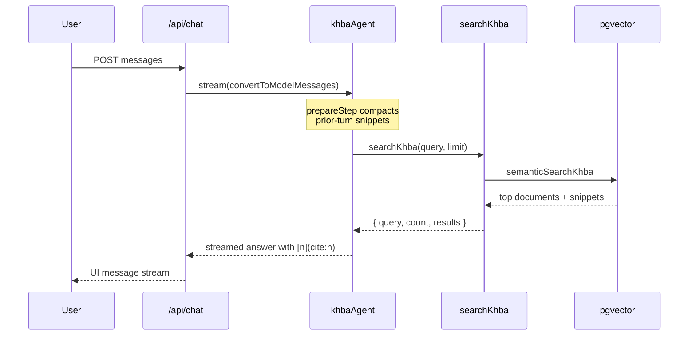
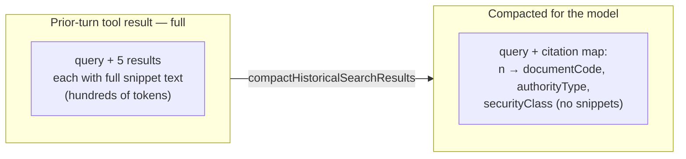
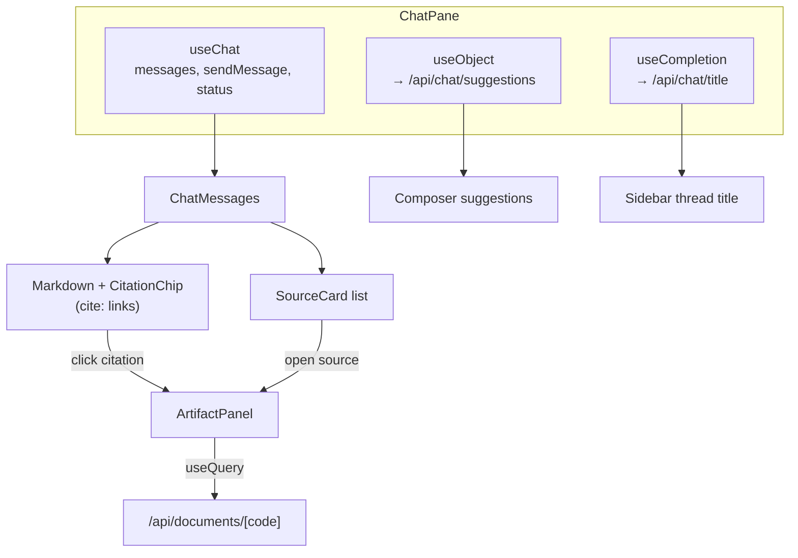
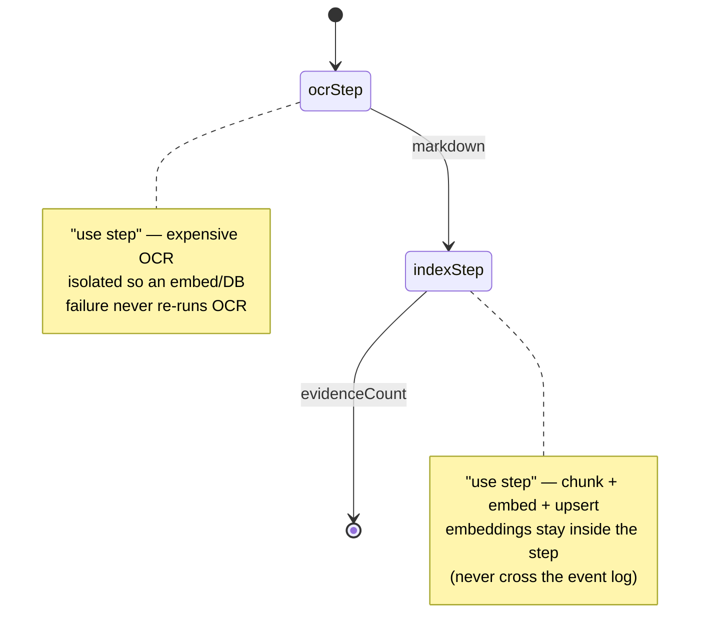

# KHBA Assistant — Implementation Documentation

> **Project:** KHBA Assistant (W Labs) · Retrieval-Augmented legal/administrative chat
> **Stack:** Next.js 16 · React 19 · Vercel AI SDK v7 · Supabase Postgres + pgvector · Drizzle ORM · LlamaCloud Agentic OCR
> **Status:** Proof of concept — semantic RAG working end to end; durable-ingestion (Vercel Workflow) prototyped
> **Language:** English · [한국어 버전](./khba-rag.ko.md)

---

## Table of contents

1. [What KHBA is](#1-what-khba-is)
2. [System architecture](#2-system-architecture)
3. [Data model](#3-data-model)
4. [Ingestion pipeline](#4-ingestion-pipeline)
5. [Semantic chunking](#5-semantic-chunking)
6. [Embeddings](#6-embeddings)
7. [Semantic retrieval](#7-semantic-retrieval)
8. [Chat agent](#8-chat-agent)
9. [Context compaction](#9-context-compaction)
10. [Frontend chat experience](#10-frontend-chat-experience)
11. [Durable ingestion — Vercel Workflow POC](#11-durable-ingestion--vercel-workflow-poc)
12. [API surface](#12-api-surface)
13. [Environment & commands](#13-environment--commands)

---

## 1. What KHBA is

KHBA is a **retrieval-augmented chat assistant** for Korean legal and administrative
documents (laws, ordinances, administrative rules, interpretations, association guides,
member cases). A user asks a question in natural language; the assistant searches an
indexed corpus, grounds its answer in the retrieved passages, and **cites every claim**
back to the exact source document, which the user can open in a side panel.

There are two halves to the system:

- **Ingestion (offline / admin)** — turn source PDFs into searchable, embedded evidence.
- **Query (online / user)** — retrieve relevant evidence and answer with inline citations.



---

## 2. System architecture

The application is a single Next.js App Router project. The RAG-specific code is grouped
by responsibility:

| Layer | Location | Responsibility |
| --- | --- | --- |
| Chat agent | `lib/ai/khba-agent.ts` | `ToolLoopAgent`, instructions, citation rules, step budget |
| Search tool | `lib/ai/tools/search-khba.tool.ts` | The `searchKhba` tool the model calls |
| Retrieval | `lib/ai/retrieval.ts` | pgvector semantic search + full-document fetch |
| Embeddings | `lib/ai/embeddings.ts` | OpenAI `text-embedding-3-small` wrappers |
| Chunking | `lib/ai/chunking.ts` | Paragraph-first + embedding-based semantic chunking |
| History compaction | `lib/ai/compact-history.ts` | Strips prior-turn snippets from model context |
| OCR | `lib/ingest/parse.ts` | LlamaCloud agentic OCR → markdown |
| Upsert | `lib/ingest/upsert.ts` | Idempotent write into the document schema |
| Manifest | `lib/ingest/manifest.ts` | The list of documents to ingest |
| CLI ingest | `scripts/ingest.ts` | `pnpm ingest` — one-shot ingestion |
| Durable ingest | `workflows/ingest.ts` + `app/api/ingest/route.ts` | Vercel Workflow POC |
| Schema | `drizzle/schemas/documents/*` | Drizzle tables + pgvector column |
| Chat UI | `components/chat/*` | Streaming chat, citations, source panel |
| Chat API | `app/api/chat/*`, `app/api/documents/[code]` | Route handlers |



---

## 3. Data model

The corpus follows the **WS-1267** document model: a four-level hierarchy from the logical
document down to the smallest citable unit of evidence, which carries the embedding vector.



### Enumerations

| Enum | Values | Notes |
| --- | --- | --- |
| `authority_type` | `LAW`, `ORDINANCE`, `ADMIN_RULE`, `INTERPRETATION`, `ASSOCIATION_GUIDE`, `MEMBER_CASE` | 6-grade source taxonomy; drives the evidence grade (A–F) |
| `security_class` | `PUBLIC`, `INTERNAL`, `CONFIDENTIAL` | Retrieval only ever returns `PUBLIC` |
| `approval_status` | `DRAFT`, `IN_REVIEW`, `LEGAL_REVIEW`, `APPROVED`, `PUBLISHED`, `RETIRED` | Review workflow state |
| `chunk_type` | `LAW_ARTICLE`, `LAW_CLAUSE`, `TABLE`, `GUIDE_TOPIC`, `CASE_SITUATION`, `CASE_JUDGMENT`, `CASE_RESULT`, `CASE_CAUTION` | Structural role of a content node |
| `index_status` | `PENDING`, `INDEXED`, `FAILED` | Only `INDEXED` rows are searchable |

### The vector column

`source_evidence.evidence_embedding` is a **`halfvec(1536)`** — a half-precision pgvector
type (half the storage of `vector`), matching OpenAI `text-embedding-3-small`'s 1536
dimensions. It is indexed with **HNSW** over the cosine operator class:

```sql
-- source-evidence.schema.ts
index("source_evidence_embedding_hnsw")
  .using("hnsw", t.evidenceEmbedding.op("halfvec_cosine_ops"))
```

> **Note:** drizzle-kit strips the operator class from generated DDL (drizzle-orm issue
> #5792), so `halfvec_cosine_ops` is patched into the migration SQL by hand.

Every table also carries audit columns (`created_at`, `updated_at`, `deleted_at`) from
`drizzle/schemas/base.ts`; retrieval filters out soft-deleted rows.

---

## 4. Ingestion pipeline

Ingestion turns a source PDF into embedded, searchable `source_evidence` rows. The list of
documents lives in `data/ingest/manifest.json`; each entry names a file plus its metadata
(document code, title, authority type, jurisdiction, security class, version).



### Stage 1 — Agentic OCR (`lib/ingest/parse.ts`)

LlamaCloud's **agentic** tier parses the whole document in a single OCR + vision + reasoning
pass, which keeps tables and cross-page layout coherent. Two options matter for RAG quality:

```ts
output_options: {
  markdown: {
    tables: {
      output_tables_as_markdown: true,  // pipe tables, not HTML <table>
      merge_continued_tables: true,     // stitch tables that span pages
    },
  },
}
```

Pipe tables (rather than HTML) are far friendlier to chunking and embeddings. Only
successfully-parsed pages are joined into the final markdown.

### Stage 2 — Semantic chunking

See [§5](#5-semantic-chunking).

### Stage 3 — Embeddings

See [§6](#6-embeddings).

### Stage 4 — Idempotent upsert (`lib/ingest/upsert.ts`)

`upsertDocuments` writes the full hierarchy for each document and is **idempotent**: it
first deletes any existing rows for the same `document_code` (cascading through versions,
nodes, and evidence), then re-inserts. This means re-ingesting a document is always safe.

For each chunk it writes a `content_node` (path `CODE#n`) and a `source_evidence` row with:

- the chunk text as `original_text`,
- `evidence_grade` derived from authority type (`LAW→A`, `ORDINANCE→B`, `ADMIN_RULE→C`,
  `INTERPRETATION→D`, `ASSOCIATION_GUIDE→E`, `MEMBER_CASE→F`),
- the embedding cast to `halfvec(1536)`,
- `index_status = 'INDEXED'` so it becomes immediately searchable.

The half-vector is written with an explicit cast:

```ts
evidenceEmbedding: sql`${vectorLiteral}::halfvec(${sql.raw(String(EMBEDDING_DIMENSIONS))})`
```

### Running it

`scripts/ingest.ts` (`pnpm ingest`) drives the whole pipeline for every manifest entry.
It loads `.env` first, then connects to Supabase's transaction pooler with the settings the
pooler requires:

```ts
postgres(process.env.DATABASE_URL, {
  ssl: "require",   // pooler rejects plaintext
  prepare: false,   // no prepared statements over the pooler
  max: 1,
})
```

> **The pooler gotcha:** without `ssl: "require"`, the connection hangs silently. This was
> the single biggest blocker during bring-up.

The current manifest holds **11 documents** — 5 generated Korean samples plus 6 Seoul
Metropolitan Government ordinances.

---

## 5. Semantic chunking

Fixed-size chunking cuts across sentences and articles; KHBA instead chunks **semantically**
so that each chunk is a topically-coherent unit. `lib/ai/chunking.ts` does this in three steps:



- **Base units** are paragraphs — the natural unit for legal/administrative text. Any
  paragraph over the character cap is sub-split by langchain's
  `RecursiveCharacterTextSplitter` using a separator list tuned for Korean and English
  (newlines, `。`, `.`, `!`, `?`, `；`, `;`, spaces).
- **Merge pass:** each unit is embedded, then adjacent units are merged while their cosine
  distance stays below `mergeThreshold` (0.12) **and** the combined length stays under
  `maxChunkChars` (1200). A topic shift (distance jump) starts a new chunk.

This produces variable-length chunks that respect topic boundaries — a paragraph about
parking-ratio calculation stays whole, and unrelated neighboring paragraphs don't bleed
into it.

> An earlier version collapsed each document to a single chunk (the minimum-size threshold
> was too high). The paragraph-first design fixed that.

---

## 6. Embeddings

`lib/ai/embeddings.ts` wraps the Vercel AI SDK's `embed` / `embedMany` over OpenAI
`text-embedding-3-small`:

| Constant | Value |
| --- | --- |
| `EMBEDDING_MODEL_ID` | `text-embedding-3-small` |
| `EMBEDDING_DIMENSIONS` | `1536` |

- `embedText(value)` — a single vector (used for the query at retrieval time).
- `embedTexts(values)` — a batch via `embedMany` (used during chunking and ingestion).

The dimension is deliberately fixed at 1536 to match the `halfvec(1536)` column. Change the
model and you must change both the column dimension and re-embed the corpus.

---

## 7. Semantic retrieval

`semanticSearchKhba(query, limit)` in `lib/ai/retrieval.ts` is the read path. It embeds the
query, then runs a cosine-distance search over `source_evidence`:



Key details:

- **Cosine distance** via the pgvector `<=>` operator; the query vector is cast to
  `halfvec(1536)` to match the column. `similarity` is reported as `1 - distance`.
- **PUBLIC only.** The chat endpoint is unauthenticated, so retrieval hard-filters to
  `security_class = 'PUBLIC'` and `index_status = 'INDEXED'`.
- **One result per document.** It over-fetches `limit × 4` rows and dedupes by
  `document_code`, keeping each document's best-matching passage. This avoids five near-
  duplicate chunks from the same ordinance crowding out other documents.

A second function, `getDocumentByCode(code)`, powers the source panel: it returns the
**entire latest version** of a PUBLIC document — all passages ordered by their stored
`chunkIndex` — so the user can read the whole thing, not just the cited snippet.

---

## 8. Chat agent

`lib/ai/khba-agent.ts` defines a single `ToolLoopAgent` (Vercel AI SDK v7) used by the
`/api/chat` route handler.



- **Model:** `openai("gpt-4o-mini")`.
- **Instructions:** call `searchKhba` first when a document could answer the question, ground
  the answer in the results, and cite inline as markdown links `[n](cite:n)` where `n` is the
  1-based position in the `results` array. Never invent a citation; if nothing relevant is
  found, say so plainly.
- **Step budget:** `stopWhen: stepCountIs(5)` — enough to search then answer (and re-search
  if needed) without runaway loops.
- **`prepareStep`:** compacts historical search results before each step — see [§9](#9-context-compaction).

### The search tool (`lib/ai/tools/search-khba.tool.ts`)

A single `tool()` with a Zod input schema (`query`, and `limit` 1–10, default 5). It calls
`semanticSearchKhba` and returns `{ query, count, results }`. On failure it **returns no
results rather than fabricating** — the assistant then honestly says nothing relevant was
found instead of citing an invented document.

---

## 9. Context compaction

A multi-turn conversation re-sends prior tool results on every step. Each `searchKhba`
result carries full passage snippets, so a long chat balloons the model's context with text
it already used. `lib/ai/compact-history.ts` fixes this via the agent's `prepareStep` hook.



- It identifies **historical** `searchKhba` tool calls by their `toolCallId` in
  `initialMessages` (i.e. results that arrived in prior turns).
- For those, it replaces the tool result's `output.value` with a compact **citation map**:
  `{ note, query, citations: [{ n, documentCode, authorityType, securityClass }] }`.
- The **current turn's** search result is left fully intact, so the answer stays grounded in
  real passage text.

Crucially this only rewrites what the **model** sees this step. The UI message stream is
untouched, so the source cards and the document panel still have the full data.

---

## 10. Frontend chat experience

The chat UI (`components/chat/*`) is built on the Vercel AI SDK React hooks. `ChatPane`
orchestrates the whole surface.



Notable pieces:

- **Streaming chat** — `useChat` drives the message list; `sendMessage({ text })` posts to
  `/api/chat`. A fresh `/chat` mints a UUID, stashes the first message, and routes to
  `/chat/[id]`, where the pending message is sent and a title is generated.
- **Citations** — answers contain `[n](cite:n)` markdown links. `Markdown` (`markdown.tsx`)
  uses a custom `urlTransform` to preserve the `cite:` scheme, and renders each as a
  `CitationChip` — a numbered button with a hover tooltip (title · code · authority ·
  classification). Clicking it opens the source panel.
- **Source cards** — the assistant message pulls `results` out of the `searchKhba` tool part
  (`tool-searchKhba`, state `output-available`) and lists them under "Where this came from".
- **Search skeleton** — while the tool part is in an input state
  (`input-streaming` / `input-available`), a "Searching sources…" skeleton shows, driven
  purely by the tool-call lifecycle.
- **Artifact panel** — `ArtifactPanel` lazy-loads the full document via React Query against
  `/api/documents/[code]`, renders every passage, highlights the cited one, and falls back to
  the snippet if the fetch fails.
- **Dynamic suggestions** — `useObject` streams up to four follow-up questions
  (`streamObject` + a Zod schema on `/api/chat/suggestions`), with a loading skeleton until
  the first one arrives; it falls back to static suggestions.
- **Streamed title** — `useCompletion` (text protocol) streams a 3–6 word title from
  `/api/chat/title` into the sidebar.
- **Scroll behavior** — auto-follows streaming output only if the user is at the bottom,
  using `useLayoutEffect` (before paint, no flicker) plus a scroll-to-bottom button.

---

## 11. Durable ingestion — Vercel Workflow POC

The CLI script is fine for local batch ingestion, but agentic OCR is slow and occasionally
flaky, and a serverless function would time out. `workflows/ingest.ts` prototypes a
**durable** version with the Vercel Workflow SDK: work is split into steps that are
independently retried and survive crashes/timeouts, and the run is observable in the
Workflows dashboard.



- **`ingestDocumentWorkflow`** (`"use workflow"`) is the deterministic orchestrator — all I/O
  lives in steps.
- **`ocrStep`** (`"use step"`) isolates the expensive LlamaCloud call, so a later failure
  never re-charges for OCR.
- **`indexStep`** (`"use step"`) does chunk + embed + upsert. The 1536-dim embeddings stay
  **inside** the step so they never cross a step boundary and bloat the durable event log.
- **`app/api/ingest/route.ts`** is an `requireAuth`-gated `POST` that reads the manifest and
  fans out one `start(ingestDocumentWorkflow, [entry])` **run per document** (independent
  retries + parallelism), returning the run IDs immediately.
- **`next.config.ts`** wraps the config with `withWorkflow`, which generates the
  `/.well-known/workflow/v1/*` routes.

> **Scope of the POC:** the durable path runs only via the Next app (the `withWorkflow`
> runtime), not via `tsx`. `pnpm ingest` remains the CLI path; the workflow is the
> production-shaped alternative. Build-verified; not yet the default ingest path.

---

## 12. API surface

| Route | Method | Auth | Purpose |
| --- | --- | --- | --- |
| `/api/chat` | POST | public | Stream a grounded, cited answer (the agent) |
| `/api/chat/title` | POST | public | Stream a short conversation title |
| `/api/chat/suggestions` | POST | public | Stream up to 4 follow-up questions |
| `/api/documents/[code]` | GET | public | Full PUBLIC document for the source panel |
| `/api/ingest` | POST | **auth** | Start durable ingestion runs (Workflow POC) |

All non-streaming responses use the shared `{ success, data }` / `{ success, error }` shape
from `lib/response.ts` with status codes from `constants/http-status.constant.ts`.

---

## 13. Environment & commands

### Required environment variables

| Variable | Used by |
| --- | --- |
| `DATABASE_URL` | Drizzle / retrieval / ingestion (Supabase Postgres) |
| `OPENAI_API_KEY` | Embeddings, chat, title, suggestions |
| `LLAMA_CLOUD_API_KEY` | Agentic OCR during ingestion |
| `NEXT_PUBLIC_SUPABASE_URL` | Supabase client |
| `NEXT_PUBLIC_SUPABASE_PUBLISHABLE_KEY` | Supabase client |

### Commands

```bash
pnpm dev            # Next.js dev server
pnpm ingest         # Run the ingestion pipeline over data/ingest/manifest.json
pnpm sample:pdf     # Regenerate the sample Korean PDFs
pnpm db:push        # Push the Drizzle schema (incl. pgvector column)
pnpm build          # Production build (also generates the Workflow routes)
```

### Ingesting new documents

1. Drop the PDF into `data/documents/`.
2. Add an entry to `data/ingest/manifest.json` (file path, `documentCode`, `title`,
   `authorityType`, `jurisdictionCode`, `securityClass`, `version`).
3. Run `pnpm ingest`. Re-ingesting is idempotent (delete-by-code, then insert).

---

*Generated as living documentation for the KHBA Assistant proof of concept. Keep it in sync
with the code it describes.*
