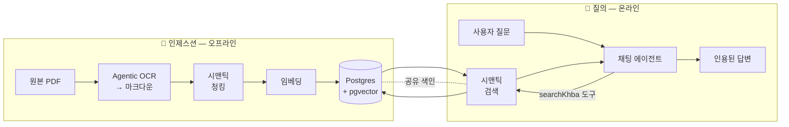
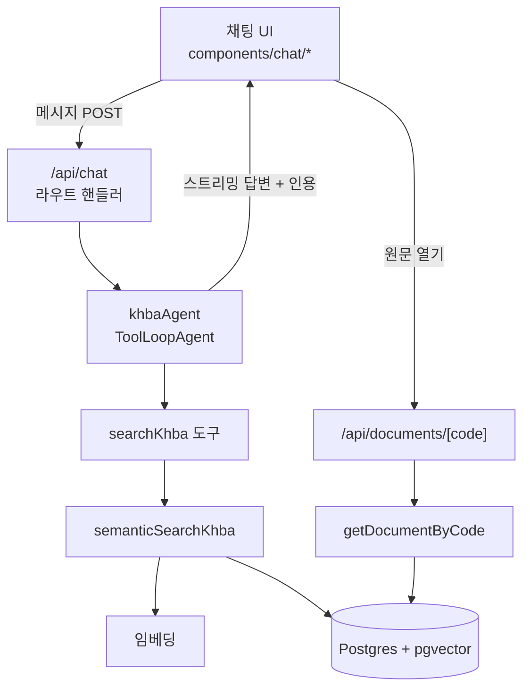
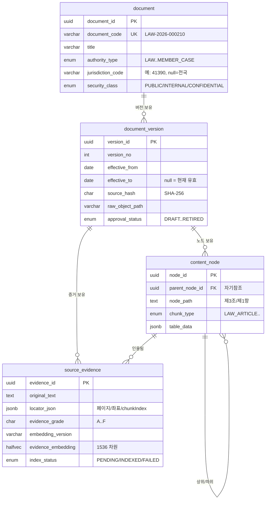
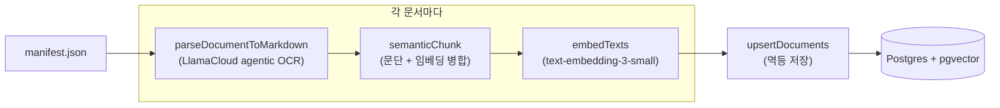
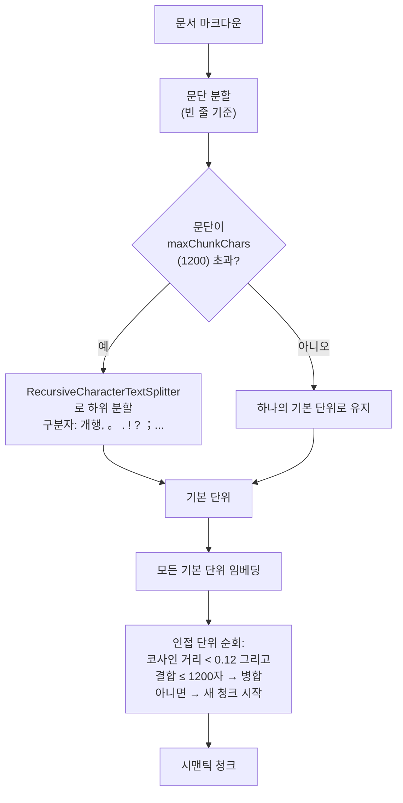
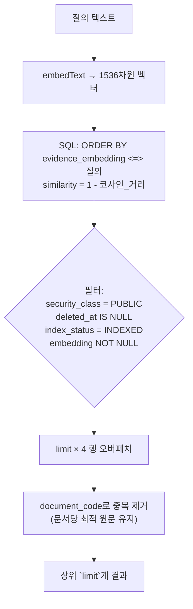
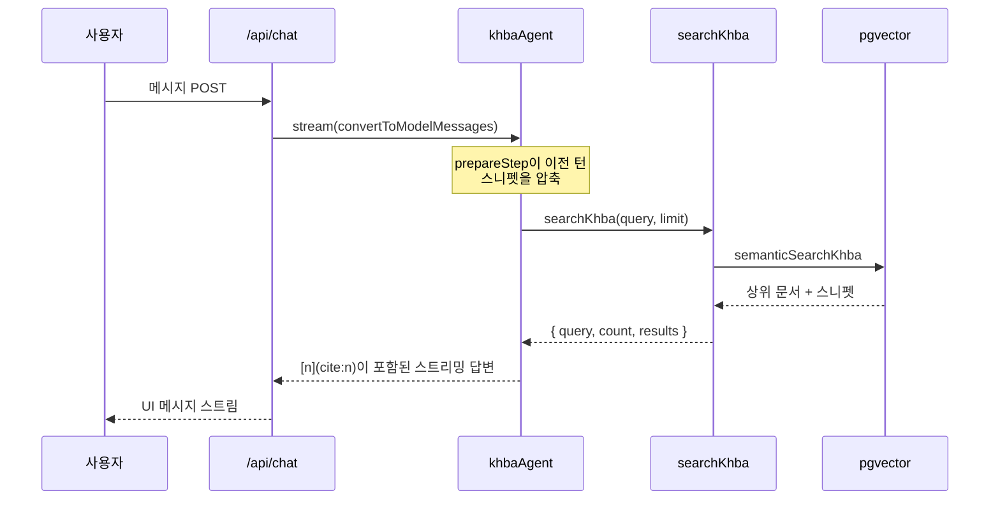
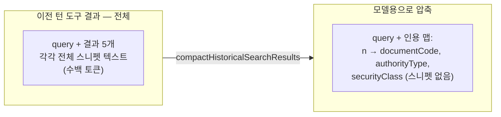
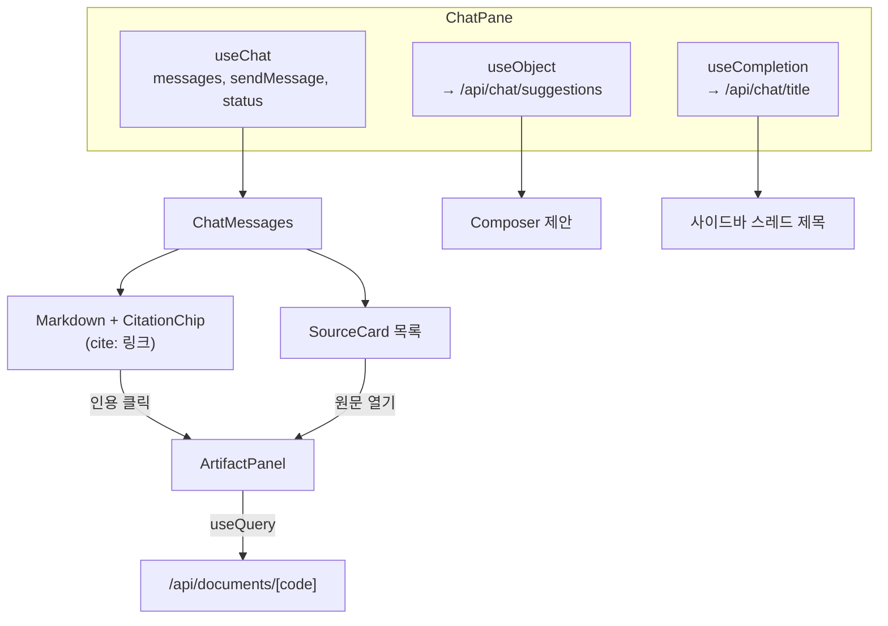
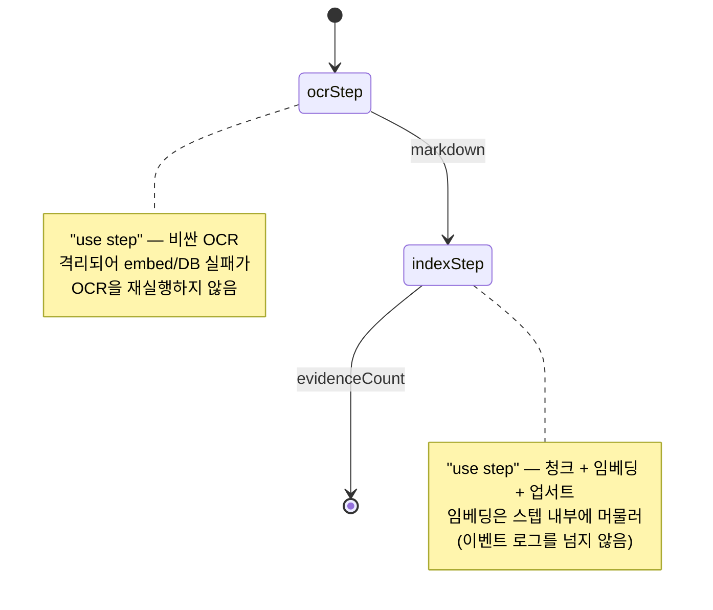

# KHBA 어시스턴트 — 구현 문서

> **프로젝트:** KHBA 어시스턴트 (W Labs) · 검색 증강(RAG) 법령·행정 문서 채팅
> **기술 스택:** Next.js 16 · React 19 · Vercel AI SDK v7 · Supabase Postgres + pgvector · Drizzle ORM · LlamaCloud Agentic OCR
> **상태:** 개념 증명(PoC) — 시맨틱 RAG 엔드투엔드 동작 · 내구성 인제스션(Vercel Workflow) 프로토타입 완료
> **언어:** 한국어 · [English version](./khba-rag.en.md)

---

## 목차

1. [KHBA란](#1-khba란)
2. [시스템 아키텍처](#2-시스템-아키텍처)
3. [데이터 모델](#3-데이터-모델)
4. [인제스션 파이프라인](#4-인제스션-파이프라인)
5. [시맨틱 청킹](#5-시맨틱-청킹)
6. [임베딩](#6-임베딩)
7. [시맨틱 검색](#7-시맨틱-검색)
8. [채팅 에이전트](#8-채팅-에이전트)
9. [컨텍스트 압축](#9-컨텍스트-압축)
10. [프론트엔드 채팅 경험](#10-프론트엔드-채팅-경험)
11. [내구성 인제스션 — Vercel Workflow PoC](#11-내구성-인제스션--vercel-workflow-poc)
12. [API 목록](#12-api-목록)
13. [환경 변수 및 명령어](#13-환경-변수-및-명령어)

---

## 1. KHBA란

KHBA는 한국의 법령·행정 문서(법률, 조례, 행정규칙, 유권해석, 협회 지침, 회원 사례)를 위한
**검색 증강(RAG) 채팅 어시스턴트**입니다. 사용자가 자연어로 질문하면, 어시스턴트는 색인된
말뭉치를 검색하고, 검색된 원문에 근거해 답변을 생성하며, **모든 주장에 출처를 인용**합니다.
사용자는 인용된 원문 문서를 사이드 패널에서 바로 열어볼 수 있습니다.

시스템은 크게 두 부분으로 나뉩니다.

- **인제스션 (오프라인 / 관리자)** — 원본 PDF를 검색 가능한 임베딩 증거로 변환합니다.
- **질의 (온라인 / 사용자)** — 관련 증거를 검색해 인라인 인용과 함께 답변합니다.



---

## 2. 시스템 아키텍처

애플리케이션은 하나의 Next.js App Router 프로젝트입니다. RAG 관련 코드는 책임별로
구성되어 있습니다.

| 계층 | 위치 | 책임 |
| --- | --- | --- |
| 채팅 에이전트 | `lib/ai/khba-agent.ts` | `ToolLoopAgent`, 지침, 인용 규칙, 스텝 예산 |
| 검색 도구 | `lib/ai/tools/search-khba.tool.ts` | 모델이 호출하는 `searchKhba` 도구 |
| 검색 | `lib/ai/retrieval.ts` | pgvector 시맨틱 검색 + 전체 문서 조회 |
| 임베딩 | `lib/ai/embeddings.ts` | OpenAI `text-embedding-3-small` 래퍼 |
| 청킹 | `lib/ai/chunking.ts` | 문단 우선 + 임베딩 기반 시맨틱 청킹 |
| 이력 압축 | `lib/ai/compact-history.ts` | 이전 턴 스니펫을 모델 컨텍스트에서 제거 |
| OCR | `lib/ingest/parse.ts` | LlamaCloud agentic OCR → 마크다운 |
| 업서트 | `lib/ingest/upsert.ts` | 문서 스키마로의 멱등 저장 |
| 매니페스트 | `lib/ingest/manifest.ts` | 인제스션 대상 문서 목록 |
| CLI 인제스트 | `scripts/ingest.ts` | `pnpm ingest` — 일회성 인제스션 |
| 내구성 인제스트 | `workflows/ingest.ts` + `app/api/ingest/route.ts` | Vercel Workflow PoC |
| 스키마 | `drizzle/schemas/documents/*` | Drizzle 테이블 + pgvector 컬럼 |
| 채팅 UI | `components/chat/*` | 스트리밍 채팅, 인용, 원문 패널 |
| 채팅 API | `app/api/chat/*`, `app/api/documents/[code]` | 라우트 핸들러 |



---

## 3. 데이터 모델

말뭉치는 **WS-1267** 문서 모델을 따릅니다. 논리적 문서에서부터 임베딩 벡터를 담는
가장 작은 인용 가능 증거 단위까지 4단계 계층 구조입니다.



### 열거형(Enum)

| Enum | 값 | 설명 |
| --- | --- | --- |
| `authority_type` | `LAW`, `ORDINANCE`, `ADMIN_RULE`, `INTERPRETATION`, `ASSOCIATION_GUIDE`, `MEMBER_CASE` | 6등급 출처 분류 체계; 증거 등급(A–F)을 결정 |
| `security_class` | `PUBLIC`, `INTERNAL`, `CONFIDENTIAL` | 검색은 항상 `PUBLIC`만 반환 |
| `approval_status` | `DRAFT`, `IN_REVIEW`, `LEGAL_REVIEW`, `APPROVED`, `PUBLISHED`, `RETIRED` | 검토 워크플로 상태 |
| `chunk_type` | `LAW_ARTICLE`, `LAW_CLAUSE`, `TABLE`, `GUIDE_TOPIC`, `CASE_SITUATION`, `CASE_JUDGMENT`, `CASE_RESULT`, `CASE_CAUTION` | 콘텐츠 노드의 구조적 역할 |
| `index_status` | `PENDING`, `INDEXED`, `FAILED` | `INDEXED` 행만 검색 대상 |

### 벡터 컬럼

`source_evidence.evidence_embedding`은 **`halfvec(1536)`** 타입입니다. 반정밀도 pgvector
타입(`vector`의 절반 저장 공간)으로, OpenAI `text-embedding-3-small`의 1536 차원과
일치합니다. 코사인 연산자 클래스 기반 **HNSW**로 색인됩니다.

```sql
-- source-evidence.schema.ts
index("source_evidence_embedding_hnsw")
  .using("hnsw", t.evidenceEmbedding.op("halfvec_cosine_ops"))
```

> **참고:** drizzle-kit이 생성 DDL에서 연산자 클래스를 제거하기 때문(drizzle-orm 이슈
> #5792), `halfvec_cosine_ops`는 마이그레이션 SQL에 수동으로 추가합니다.

모든 테이블은 `drizzle/schemas/base.ts`의 감사 컬럼(`created_at`, `updated_at`,
`deleted_at`)을 함께 가지며, 검색 시 소프트 삭제된 행은 제외됩니다.

---

## 4. 인제스션 파이프라인

인제스션은 원본 PDF를 임베딩되어 검색 가능한 `source_evidence` 행으로 변환합니다. 문서
목록은 `data/ingest/manifest.json`에 있으며, 각 항목은 파일과 메타데이터(문서 코드, 제목,
authority type, 관할 코드, 보안 등급, 버전)를 담습니다.



### 1단계 — Agentic OCR (`lib/ingest/parse.ts`)

LlamaCloud의 **agentic** 티어는 문서 전체를 OCR + 비전 + 추론 단일 패스로 파싱하여,
표와 페이지 간 레이아웃의 일관성을 유지합니다. RAG 품질에 중요한 두 옵션이 있습니다.

```ts
output_options: {
  markdown: {
    tables: {
      output_tables_as_markdown: true,  // HTML <table>가 아닌 파이프 표
      merge_continued_tables: true,     // 페이지에 걸친 표를 이어붙임
    },
  },
}
```

(HTML이 아닌) 파이프 표는 청킹과 임베딩에 훨씬 유리합니다. 성공적으로 파싱된 페이지만
최종 마크다운으로 결합됩니다.

### 2단계 — 시맨틱 청킹

[§5](#5-시맨틱-청킹) 참조.

### 3단계 — 임베딩

[§6](#6-임베딩) 참조.

### 4단계 — 멱등 업서트 (`lib/ingest/upsert.ts`)

`upsertDocuments`는 각 문서의 전체 계층을 저장하며 **멱등적**입니다. 동일한
`document_code`의 기존 행을 먼저 삭제(버전·노드·증거로 캐스케이드)한 뒤 다시 삽입합니다.
따라서 문서 재인제스션은 항상 안전합니다.

각 청크마다 `content_node`(경로 `CODE#n`)와 다음을 담은 `source_evidence` 행을 씁니다.

- `original_text`로 저장되는 청크 텍스트,
- authority type에서 파생된 `evidence_grade`(`LAW→A`, `ORDINANCE→B`, `ADMIN_RULE→C`,
  `INTERPRETATION→D`, `ASSOCIATION_GUIDE→E`, `MEMBER_CASE→F`),
- `halfvec(1536)`으로 캐스팅된 임베딩,
- 즉시 검색 가능하도록 `index_status = 'INDEXED'`.

반정밀도 벡터는 명시적 캐스트로 기록됩니다.

```ts
evidenceEmbedding: sql`${vectorLiteral}::halfvec(${sql.raw(String(EMBEDDING_DIMENSIONS))})`
```

### 실행

`scripts/ingest.ts`(`pnpm ingest`)가 모든 매니페스트 항목에 대해 전체 파이프라인을
구동합니다. `.env`를 먼저 로드한 뒤, Supabase 트랜잭션 풀러가 요구하는 설정으로 연결합니다.

```ts
postgres(process.env.DATABASE_URL, {
  ssl: "require",   // 풀러는 평문 연결을 거부
  prepare: false,   // 풀러에서는 prepared statement 미사용
  max: 1,
})
```

> **풀러 함정:** `ssl: "require"` 없이는 연결이 조용히 멈춥니다. 초기 구축 중 가장 큰
> 걸림돌이었습니다.

현재 매니페스트에는 **문서 11개**가 있습니다 — 생성된 한국어 샘플 5개 + 서울특별시
조례 6개.

---

## 5. 시맨틱 청킹

고정 크기 청킹은 문장과 조문을 가로질러 잘라버립니다. KHBA는 대신 각 청크가 주제적으로
일관된 단위가 되도록 **시맨틱하게** 청킹합니다. `lib/ai/chunking.ts`가 3단계로 처리합니다.



- **기본 단위**는 문단입니다 — 법령·행정 텍스트의 자연스러운 단위입니다. 글자 수 상한을
  넘는 문단은 langchain의 `RecursiveCharacterTextSplitter`가 한국어·영어에 맞춘 구분자
  목록(개행, `。`, `.`, `!`, `?`, `；`, `;`, 공백)으로 하위 분할합니다.
- **병합 패스:** 각 단위를 임베딩한 뒤, 인접 단위의 코사인 거리가 `mergeThreshold`(0.12)
  미만이고 **동시에** 결합 길이가 `maxChunkChars`(1200) 미만이면 병합합니다. 주제 전환
  (거리 급증)이 발생하면 새 청크를 시작합니다.

이렇게 하면 주제 경계를 존중하는 가변 길이 청크가 만들어집니다 — 주차 대수 산정에 관한
문단은 온전히 유지되고, 무관한 이웃 문단이 섞여 들어오지 않습니다.

> 이전 버전은 각 문서를 단일 청크로 뭉개버렸습니다(최소 크기 임계값이 너무 높았음).
> 문단 우선 설계가 이를 해결했습니다.

---

## 6. 임베딩

`lib/ai/embeddings.ts`는 OpenAI `text-embedding-3-small` 위에서 Vercel AI SDK의
`embed` / `embedMany`를 래핑합니다.

| 상수 | 값 |
| --- | --- |
| `EMBEDDING_MODEL_ID` | `text-embedding-3-small` |
| `EMBEDDING_DIMENSIONS` | `1536` |

- `embedText(value)` — 단일 벡터 (검색 시 질의에 사용).
- `embedTexts(values)` — `embedMany`를 통한 배치 (청킹·인제스션에 사용).

차원은 `halfvec(1536)` 컬럼과 일치하도록 의도적으로 1536으로 고정됩니다. 모델을 바꾸면
컬럼 차원도 바꾸고 말뭉치를 재임베딩해야 합니다.

---

## 7. 시맨틱 검색

`lib/ai/retrieval.ts`의 `semanticSearchKhba(query, limit)`가 읽기 경로입니다. 질의를
임베딩한 뒤 `source_evidence`에 대해 코사인 거리 검색을 수행합니다.



핵심 사항:

- **코사인 거리**는 pgvector `<=>` 연산자로 계산하며, 질의 벡터는 컬럼과 맞추기 위해
  `halfvec(1536)`으로 캐스팅됩니다. `similarity`는 `1 - distance`로 보고됩니다.
- **PUBLIC 전용.** 채팅 엔드포인트는 비인증이므로, 검색은 `security_class = 'PUBLIC'`
  및 `index_status = 'INDEXED'`로 강하게 필터링합니다.
- **문서당 결과 하나.** `limit × 4` 행을 오버페치한 뒤 `document_code`로 중복 제거하여
  각 문서의 최적 매칭 원문만 남깁니다. 이렇게 하면 같은 조례의 유사 중복 청크 5개가 다른
  문서를 밀어내는 일을 방지합니다.

두 번째 함수 `getDocumentByCode(code)`는 원문 패널을 구동합니다. PUBLIC 문서의 **최신
버전 전체**(저장된 `chunkIndex` 순서로 정렬된 모든 원문)를 반환하여, 사용자가 인용된
스니펫뿐 아니라 문서 전체를 읽을 수 있게 합니다.

---

## 8. 채팅 에이전트

`lib/ai/khba-agent.ts`는 `/api/chat` 라우트 핸들러가 사용하는 단일 `ToolLoopAgent`
(Vercel AI SDK v7)를 정의합니다.



- **모델:** `openai("gpt-4o-mini")`.
- **지침:** 문서로 답할 수 있는 질문이면 먼저 `searchKhba`를 호출하고, 결과에 근거해
  답변하며, `results` 배열의 1-기반 위치 `n`을 사용해 `[n](cite:n)` 마크다운 링크로 인라인
  인용합니다. 절대 인용을 지어내지 않으며, 관련 결과가 없으면 그렇다고 솔직히 말합니다.
- **스텝 예산:** `stopWhen: stepCountIs(5)` — 검색 후 답변(필요 시 재검색)에는 충분하되
  무한 루프는 방지합니다.
- **`prepareStep`:** 각 스텝 전에 과거 검색 결과를 압축합니다 — [§9](#9-컨텍스트-압축) 참조.

### 검색 도구 (`lib/ai/tools/search-khba.tool.ts`)

Zod 입력 스키마(`query`, 그리고 `limit` 1–10, 기본 5)를 가진 단일 `tool()`입니다.
`semanticSearchKhba`를 호출하고 `{ query, count, results }`를 반환합니다. 실패 시
**결과를 지어내지 않고 빈 결과를 반환**합니다 — 그러면 어시스턴트는 지어낸 문서를
인용하는 대신 관련 결과가 없다고 정직하게 답합니다.

---

## 9. 컨텍스트 압축

멀티턴 대화는 매 스텝마다 이전 도구 결과를 재전송합니다. 각 `searchKhba` 결과는 전체
원문 스니펫을 담고 있어, 긴 대화는 이미 사용한 텍스트로 모델 컨텍스트를 부풀립니다.
`lib/ai/compact-history.ts`가 에이전트의 `prepareStep` 훅을 통해 이를 해결합니다.



- `initialMessages` 안의 `toolCallId`로 **과거** `searchKhba` 도구 호출(즉 이전 턴에서
  도착한 결과)을 식별합니다.
- 해당 결과의 `output.value`를 간결한 **인용 맵**으로 대체합니다:
  `{ note, query, citations: [{ n, documentCode, authorityType, securityClass }] }`.
- **현재 턴의** 검색 결과는 완전히 그대로 두어, 답변이 실제 원문 텍스트에 계속 근거하도록
  합니다.

결정적으로 이것은 이번 스텝에서 **모델**이 보는 내용만 다시 씁니다. UI 메시지 스트림은
건드리지 않으므로 원문 카드와 문서 패널은 여전히 전체 데이터를 유지합니다.

---

## 10. 프론트엔드 채팅 경험

채팅 UI(`components/chat/*`)는 Vercel AI SDK React 훅으로 구성됩니다. `ChatPane`이 전체
화면을 조율합니다.



주요 요소:

- **스트리밍 채팅** — `useChat`이 메시지 목록을 구동하고, `sendMessage({ text })`가
  `/api/chat`에 전송합니다. 새 `/chat`은 UUID를 발급하고 첫 메시지를 임시 보관한 뒤
  `/chat/[id]`로 이동하며, 그곳에서 대기 중이던 메시지를 전송하고 제목을 생성합니다.
- **인용** — 답변에는 `[n](cite:n)` 마크다운 링크가 포함됩니다. `Markdown`(`markdown.tsx`)은
  커스텀 `urlTransform`으로 `cite:` 스킴을 보존하고, 각 인용을 `CitationChip`(번호 버튼 +
  호버 툴팁: 제목 · 코드 · authority · 보안 등급)으로 렌더링합니다. 클릭하면 원문 패널이
  열립니다.
- **원문 카드** — 어시스턴트 메시지는 `searchKhba` 도구 파트(`tool-searchKhba`, 상태
  `output-available`)에서 `results`를 꺼내 "이 답변의 출처" 아래에 나열합니다.
- **검색 스켈레톤** — 도구 파트가 입력 상태(`input-streaming` / `input-available`)일 동안
  "출처 검색 중…" 스켈레톤이 표시되며, 이는 전적으로 도구 호출 생명주기에 의해 구동됩니다.
- **아티팩트 패널** — `ArtifactPanel`은 React Query로 `/api/documents/[code]`에서 전체
  문서를 지연 로드하고, 모든 원문을 렌더링하며, 인용된 원문을 하이라이트하고, 조회 실패
  시 스니펫으로 폴백합니다.
- **동적 제안** — `useObject`가 후속 질문 최대 4개를 스트리밍합니다(`streamObject` +
  `/api/chat/suggestions`의 Zod 스키마). 첫 제안이 도착할 때까지 로딩 스켈레톤을 보여주고,
  정적 제안으로 폴백합니다.
- **스트리밍 제목** — `useCompletion`(텍스트 프로토콜)이 `/api/chat/title`에서 3–6단어
  제목을 사이드바로 스트리밍합니다.
- **스크롤 동작** — 사용자가 맨 아래에 있을 때만 스트리밍 출력을 자동으로 따라가며,
  `useLayoutEffect`(페인트 전, 깜빡임 없음)와 맨 아래로 이동 버튼을 함께 사용합니다.

---

## 11. 내구성 인제스션 — Vercel Workflow PoC

CLI 스크립트는 로컬 배치 인제스션에는 충분하지만, agentic OCR은 느리고 이따금 불안정하며
서버리스 함수는 타임아웃됩니다. `workflows/ingest.ts`는 Vercel Workflow SDK로 **내구성**
버전을 프로토타이핑합니다. 작업을 독립적으로 재시도되고 크래시/타임아웃을 견디는 스텝으로
분할하며, 실행은 Workflows 대시보드에서 관찰할 수 있습니다.



- **`ingestDocumentWorkflow`**(`"use workflow"`)는 결정론적 오케스트레이터입니다 — 모든
  I/O는 스텝 안에 있습니다.
- **`ocrStep`**(`"use step"`)은 비싼 LlamaCloud 호출을 격리하여, 이후 실패가 OCR
  비용을 다시 청구하지 않도록 합니다.
- **`indexStep`**(`"use step"`)은 청크 + 임베딩 + 업서트를 수행합니다. 1536차원 임베딩은
  스텝 **내부에** 머물러 스텝 경계를 넘지 않으므로 내구성 이벤트 로그를 부풀리지 않습니다.
- **`app/api/ingest/route.ts`**는 `requireAuth`로 보호되는 `POST`로, 매니페스트를 읽고
  **문서당 실행 하나**씩 `start(ingestDocumentWorkflow, [entry])`로 팬아웃(독립 재시도 +
  병렬성)하며, 실행 ID를 즉시 반환합니다.
- **`next.config.ts`**는 설정을 `withWorkflow`로 감싸며, 이것이
  `/.well-known/workflow/v1/*` 라우트를 생성합니다.

> **PoC 범위:** 내구성 경로는 (`withWorkflow` 런타임이 있는) Next 앱을 통해서만 실행되며
> `tsx`로는 실행되지 않습니다. `pnpm ingest`는 CLI 경로로 남고, 워크플로는 프로덕션
> 형태의 대안입니다. 빌드는 검증되었으나 아직 기본 인제스트 경로는 아닙니다.

---

## 12. API 목록

| 라우트 | 메서드 | 인증 | 목적 |
| --- | --- | --- | --- |
| `/api/chat` | POST | 공개 | 근거 있는 인용 답변 스트리밍 (에이전트) |
| `/api/chat/title` | POST | 공개 | 짧은 대화 제목 스트리밍 |
| `/api/chat/suggestions` | POST | 공개 | 후속 질문 최대 4개 스트리밍 |
| `/api/documents/[code]` | GET | 공개 | 원문 패널용 PUBLIC 문서 전체 |
| `/api/ingest` | POST | **인증** | 내구성 인제스션 실행 시작 (Workflow PoC) |

모든 비스트리밍 응답은 `lib/response.ts`의 공유 `{ success, data }` / `{ success, error }`
형태와 `constants/http-status.constant.ts`의 상태 코드를 사용합니다.

---

## 13. 환경 변수 및 명령어

### 필수 환경 변수

| 변수 | 사용처 |
| --- | --- |
| `DATABASE_URL` | Drizzle / 검색 / 인제스션 (Supabase Postgres) |
| `OPENAI_API_KEY` | 임베딩, 채팅, 제목, 제안 |
| `LLAMA_CLOUD_API_KEY` | 인제스션 중 agentic OCR |
| `NEXT_PUBLIC_SUPABASE_URL` | Supabase 클라이언트 |
| `NEXT_PUBLIC_SUPABASE_PUBLISHABLE_KEY` | Supabase 클라이언트 |

### 명령어

```bash
pnpm dev            # Next.js 개발 서버
pnpm ingest         # data/ingest/manifest.json에 대해 인제스션 파이프라인 실행
pnpm sample:pdf     # 샘플 한국어 PDF 재생성
pnpm db:push        # Drizzle 스키마 푸시 (pgvector 컬럼 포함)
pnpm build          # 프로덕션 빌드 (Workflow 라우트도 생성)
```

### 새 문서 인제스션

1. PDF를 `data/documents/`에 넣습니다.
2. `data/ingest/manifest.json`에 항목 추가(파일 경로, `documentCode`, `title`,
   `authorityType`, `jurisdictionCode`, `securityClass`, `version`).
3. `pnpm ingest` 실행. 재인제스션은 멱등적입니다(코드 기준 삭제 후 삽입).

---

*KHBA 어시스턴트 개념 증명을 위한 살아있는 문서로 작성되었습니다. 설명 대상 코드와 항상
동기화된 상태로 유지하세요.*
