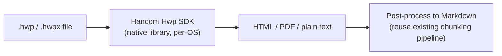
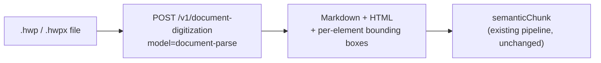
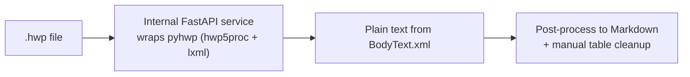
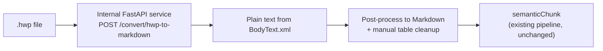

# KHBA Assistant — Document Requirements & API Plan

> **Project:** KHBA Assistant (W Labs) · Retrieval-Augmented legal/administrative chat
> **Scope of this doc:** Source-document requirements for ingestion (incl. HWP/HWPX), proposed
> parsing solutions, and the full API list needed for the project
> **Status:** Decision made — pyhwp + FastAPI chosen (see [§6](#6-recommendation--decision))
> **Related:** [Implementation documentation](./khba-rag_en.md) · **Language:** English · [한국어 버전](./khba-rag-document-requirements_ko.md)

---

## Table of contents

1. [Why this doc exists](#1-why-this-doc-exists)
2. [Document requirements](#2-document-requirements)
3. [The HWP problem](#3-the-hwp-problem)
4. [Proposed solutions for HWP ingestion](#4-proposed-solutions-for-hwp-ingestion)
5. [Solution comparison](#5-solution-comparison)
6. [Recommendation](#6-recommendation)
7. [API surface — current](#7-api-surface--current)
8. [API surface — needed for this plan](#8-api-surface--needed-for-this-plan)

---

## 1. Why this doc exists

The current POC ([§4 of the implementation doc](./khba-rag_en.md#4-ingestion-pipeline)) ingests
**PDF** source files through LlamaCloud's agentic OCR. In production, a large share of Korean
legal/administrative source material — ordinances, internal association guides, member case
files — is authored and circulated as **HWP** (한글, Hancom's proprietary format), not PDF. The
ingestion pipeline needs a defined path for that format before real documents can be loaded.

This is a **separate plan** from the POC implementation doc: it covers what document types the
system must accept, why HWP is hard, the candidate solutions, and the resulting API list —
current + newly required — for budgeting and integration work.

---

## 2. Document requirements

### 2.1 Formats the pipeline must accept

| Format                                           | Source                                                                           | Priority   | Notes                                                                  |
| ------------------------------------------------ | -------------------------------------------------------------------------------- | ---------- | ---------------------------------------------------------------------- |
| PDF                                              | Laws, ordinances published as PDF, scanned member cases                          | **Must**   | Already supported (LlamaCloud agentic OCR)                             |
| HWP (`.hwp`)                                     | Internal association guides, member case files, older government documents       | **Must**   | Dominant word-processor format in Korean government/legal contexts     |
| HWPX (`.hwpx`)                                   | Newer Hancom documents (XML-based, government-mandated for new public documents) | **Must**   | Structurally simpler than legacy `.hwp` — see [§3](#3-the-hwp-problem) |
| DOCX                                             | Occasional member submissions                                                    | **Should** | Already covered incidentally by most parsers                           |
| Scanned images (JPG/PNG/TIFF of paper documents) | Older archived records                                                           | **Should** | Needs OCR, not just format conversion                                  |

### 2.2 Per-document metadata required at intake

To populate the WS-1267 `document` / `document_version` tables
([§3 of the implementation doc](./khba-rag_en.md#3-data-model)), every ingested file — regardless
of source format — must arrive with:

- `documentCode`, `title`, `authorityType`, `jurisdictionCode`, `securityClass`, `version`
- Original file hash (`source_hash`) for change detection
- `effective_from` / `effective_to` where applicable (laws, ordinances)

### 2.3 Quality bar for parsed output

Regardless of which HWP solution is chosen, the parsed output must satisfy the same bar the
LlamaCloud PDF path already meets, since both feed the same
[semantic chunking](./khba-rag_en.md#5-semantic-chunking) stage:

- Clean **Markdown**, tables as pipe tables (not embedded images or HTML)
- Reading order preserved for multi-column layouts
- No loss of Korean text encoding (HWP's native encoding requires explicit handling)
- Article/clause numbering (`제3조`, `제1항`) preserved as plain text so `content_node.node_path`
  extraction still works

---

## 3. The HWP problem

HWP is a closed, binary, OLE-compound-document format developed by Hancom — not an open standard
like PDF or DOCX. Two practical issues follow:

- **No official cross-platform parser.** Hancom's own SDKs and the Windows OLE Automation route
  assume a Windows host with Hancom Office installed; there's no first-party Linux/serverless
  parsing path.
- **Legacy `.hwp` vs. `.hwpx`.** `.hwpx` is Hancom's newer, XML-based format (mandated for new
  Korean government documents going forward) and is comparatively easy to parse with open tools.
  Legacy `.hwp` (binary, "HWPv5") is the harder case and is what most existing archives still use.

This split matters for solution choice: a tool that only handles `.hwpx` well is not sufficient
if the corpus still contains legacy `.hwp` files.

---

## 4. Proposed solutions for HWP ingestion

### 4.1 Hancom SDK / Hancom Developer APIs

Hancom provides its own [developer platform](https://developer.hancom.com) with an **Hwp SDK**
that can open, convert, and manipulate `.hwp`/`.hwpx` files programmatically (~1,000 HWP
functions) without requiring the desktop app to be installed, plus a separate **document
conversion** service and **OLE Automation** guide for driving the Hancom Office client directly.



- **Pros:** first-party, most faithful rendering of tables/layout since it's the format owner's
  own engine; covers both legacy `.hwp` and `.hwpx`.
- **Cons:** commercial licensing, SDK is native/per-OS rather than a simple REST call, and would
  need to be wrapped in our own service layer before it fits the existing ingestion pipeline
  (which currently just calls a hosted OCR API). Adds an infra dependency (Windows/Linux native
  binary or Hancom-hosted service) not needed today.

### 4.2 Upstage Document Parse (AI-powered, hosted API)

Upstage's `document-digitization` REST API (`model=document-parse`) natively accepts `.hwp` and
`.hwpx` among its supported formats, alongside PDF/DOCX/PPTX/XLSX/images, and returns structured
Markdown/HTML output directly — the same shape our pipeline already expects from LlamaCloud.



- **Pros:** drop-in REST API — same integration shape as the current LlamaCloud step, so it can
  slot into [`lib/ingest/parse.ts`](./khba-rag_en.md#stage-1--agentic-ocr-libingestparsets) as an
  alternate branch keyed on file extension. Billed per page (~$0.01–0.04/page depending on
  add-ons), no infra to run ourselves. Table/layout recognition is a stated strength of the
  model.
- **Cons:** HWP support is a **relatively recent addition** to the API — worth a small validation
  batch against real Korean legal documents (tables, 조/항/호 numbering) before committing. Hosted
  service, so documents leave our infra during parsing (relevant for `CONFIDENTIAL`-class
  sources).

### 4.3 pyhwp + a small FastAPI wrapper (self-hosted, open source)

[`pyhwp`](https://github.com/mete0r/pyhwp) is an open-source (AGPLv3) Python library and CLI
(`hwp5proc`, `hwp5txt`, `hwp5html`, `hwp5odt`) that parses the legacy binary `.hwp` (HWPv5) format
directly, with no dependency on Hancom software. It is wrapped in a small internal FastAPI
service and called the same way the pipeline calls LlamaCloud today.



**Current implementation details:**

- **Location:** `python/main.py` (FastAPI service)
- **Endpoint:** `POST /convert/hwp-to-markdown`
- **Method:** Uses `hwp5proc unpack --vstreams` to extract virtual streams, then parses `BodyText.xml` with `lxml.etree.itertext()` for text extraction
- **Fallback:** Falls back to `PrvText.utf8` if `BodyText.xml` extraction fails or yields insufficient text
- **Integration:** `lib/ingest/hwp.ts` calls the local FastAPI service via `NEXT_PUBLIC_API_URL` environment variable
- **Cleanup:** Automatic temporary file cleanup after processing

- **Pros:** free, open source, no per-page billing, fully self-hosted (keeps `CONFIDENTIAL`
  documents in our infra), no vendor lock-in.
- **Cons:** project is explicitly marked **"Converters (Experimental)"** by its own maintainers
  and has had long gaps between releases; table and complex-layout fidelity is noticeably weaker
  than a modern OCR/VLM pipeline; **does not support `.hwpx`** (only legacy binary `.hwp`), so it
  would need to be paired with a second path for `.hwpx`; we would own the FastAPI wrapper,
  hosting, and any bug-fixing ourselves.

---

## 5. Solution comparison

|                         | Hancom SDK                                  | Upstage Document Parse                       | pyhwp + FastAPI                                                               |
| ----------------------- | ------------------------------------------- | -------------------------------------------- | ----------------------------------------------------------------------------- |
| `.hwp` (legacy) support | Full (native)                               | Yes                                          | Yes                                                                           |
| `.hwpx` support         | Full (native)                               | Yes                                          | **No**                                                                        |
| Integration shape       | Native SDK / OLE — needs a wrapper service  | REST API — matches current pipeline shape    | Self-built REST wrapper                                                       |
| Hosting                 | Self-hosted or Hancom-hosted, per licensing | Hosted by Upstage                            | Self-hosted                                                                   |
| Table/layout fidelity   | High (format owner)                         | High (stated strength; validate on our docs) | Moderate — experimental                                                       |
| Cost model              | Commercial license                          | Pay-per-page                                 | Free / infra cost only                                                        |
| Data residency          | Depends on deployment                       | Leaves infra during parsing                  | Stays in-house                                                                |
| Maintenance burden      | Low (vendor-maintained)                     | Low (vendor-maintained)                      | **High** — we maintain the wrapper and track an experimental upstream project |

---

## 6. Recommendation — Decision

**Chosen: pyhwp + a self-hosted FastAPI wrapper** — **IMPLEMENTED**

The solution has been implemented on cost grounds — it's free/open-source with no per-page billing,
versus Upstage's pay-per-page pricing or a Hancom commercial SDK license. It also keeps documents
in-house (relevant for `CONFIDENTIAL`-class sources).



**Known limitation to plan around:** pyhwp only parses legacy binary `.hwp` (HWPv5) — it does
**not** support `.hwpx`. Since newer Korean government documents are increasingly issued as
`.hwpx`, this plan needs one of the following before `.hwpx` sources show up in the manifest:

- Confirm the current/expected corpus is `.hwp`-only for now (see [§9](#9-open-questions)), and
  revisit `.hwpx` support as a follow-up once real files arrive, **or**
- Pair pyhwp with a lightweight `.hwpx` path up front — `.hwpx` is XML-based, so it can likely be
  unzipped and parsed directly (e.g. with `lxml`) without a heavyweight second dependency.

**Implementation status:**

- ✅ **FastAPI service built:** Located in `python/main.py` with endpoint `POST /convert/hwp-to-markdown`
- ✅ **Text extraction method:** Uses `hwp5proc unpack --vstreams` to extract virtual streams, then parses `BodyText.xml` with `lxml.etree.itertext()`
- ✅ **Fallback mechanism:** Falls back to `PrvText.utf8` if `BodyText.xml` extraction fails
- ✅ **Integration wired:** `lib/ingest/hwp.ts` calls the local service via `NEXT_PUBLIC_API_URL`
- ✅ **Temporary file cleanup:** Automatic cleanup after processing
- ⚠️ **Table fidelity:** Main known weak point — plan for manual review/cleanup on early ingested HWP documents with tables
- ⚠️ **Maintenance:** No vendor SLA — budget time for maintaining the wrapper and tracking upstream `pyhwp` project

**Environment variables:**

```bash
NEXT_PUBLIC_API_URL=http://localhost:8000  # Local FastAPI service URL
```

**Fallback options:** Keep **Upstage Document Parse** and the **Hancom SDK** documented above as fallback options if
pyhwp's output quality proves insufficient for a given document class, rather than removing them
from consideration.

---

## 7. API surface — current

Carried over from [§12 of the implementation doc](./khba-rag_en.md#12-api-surface) for reference:

| API / Service                                                                                            | Used for                                | Auth                           |
| -------------------------------------------------------------------------------------------------------- | --------------------------------------- | ------------------------------ |
| OpenAI `text-embedding-3-small`                                                                          | Embeddings for chunks and queries       | `OPENAI_API_KEY`               |
| OpenAI `gpt-4o-mini` (via Vercel AI SDK)                                                                 | Chat agent                              | `OPENAI_API_KEY`               |
| LlamaCloud Agentic OCR                                                                                   | PDF → Markdown parsing during ingestion | `LLAMA_CLOUD_API_KEY`          |
| Supabase Postgres + pgvector                                                                             | Storage and vector search               | `DATABASE_URL` / Supabase keys |
| Internal `/api/chat`, `/api/chat/title`, `/api/chat/suggestions`, `/api/documents/[code]`, `/api/ingest` | App route handlers                      | Mixed (see implementation doc) |

---

## 8. API surface — needed for this plan

| API / Service                                                 | Purpose                                                                                                                             | Auth / Access                                  | Status                                                                     |
| ------------------------------------------------------------- | ----------------------------------------------------------------------------------------------------------------------------------- | ---------------------------------------------- | -------------------------------------------------------------------------- |
| **Internal HWP parsing service** (pyhwp-based, FastAPI)       | Primary path: parse legacy `.hwp` into Markdown/plain text for ingestion                                                            | Self-hosted, no external auth                  | **✅ Implemented** — `python/main.py` + `lib/ingest/hwp.ts`                |
| **Upstage Document Parse** (`POST /v1/document-digitization`) | Fallback for documents pyhwp parses poorly (esp. complex tables), and candidate for `.hwpx` if a dedicated `.hwpx` path isn't built | `UPSTAGE_API_KEY`, console account             | **Documented fallback** — not provisioned unless needed                    |
| **Hancom Hwp SDK / Developer API**                            | High-fidelity fallback for documents neither pyhwp nor Upstage parse acceptably                                                     | Commercial license via Hancom Developer portal | **Documented fallback** — pending budget/licensing decision if ever needed |

**Current environment variables:**

```bash
NEXT_PUBLIC_API_URL=http://localhost:8000  # Internal FastAPI HWP service (implemented)
```

No new paid API keys are required for the chosen path. If a fallback is later exercised, add
alongside the existing set ([§13 of the implementation doc](./khba-rag_en.md#required-environment-variables)):

```bash
UPSTAGE_API_KEY=            # only if the Upstage fallback is adopted
HANCOM_SDK_LICENSE_KEY=     # only if the Hancom SDK fallback is adopted
```

---

_Proposal for review. Once a solution is approved, fold the chosen ingestion branch into
[§4 of the implementation doc](./khba-rag_en.md#4-ingestion-pipeline) as the canonical reference._
