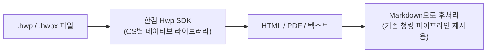
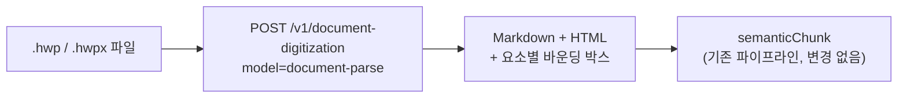
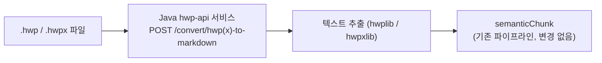

# KHBA Assistant — 문서 요구사항 및 API 계획

> **프로젝트:** KHBA Assistant (W Labs) · 검색 증강(RAG) 법령/행정 챗봇
> **이 문서의 범위:** 인제스션 대상 원본 문서 요구사항(HWP/HWPX 포함), 제안된 파싱 솔루션,
> 프로젝트에 필요한 전체 API 목록
> **상태:** 구현 완료 — 자체 호스팅 Java 서비스(`.hwp`는 `hwplib`, `.hwpx`는 `hwpxlib`)로, 기존 pyhwp + FastAPI 선택을 대체했습니다 ([§6](#6-권장-사항--결정) 참조)
> **관련 문서:** [구현 문서](./khba-rag_ko.md) · **Language:** [English](./khba-rag-document-requirements_en.md) · 한국어

---

## 목차

1. [이 문서가 필요한 이유](#1-이-문서가-필요한-이유)
2. [문서 요구사항](#2-문서-요구사항)
3. [HWP 문제](#3-hwp-문제)
4. [HWP 인제스션을 위한 제안 솔루션](#4-hwp-인제스션을-위한-제안-솔루션)
5. [솔루션 비교](#5-솔루션-비교)
6. [권장 사항 — 결정](#6-권장-사항--결정)
7. [API 목록 — 현재](#7-api-목록--현재)
8. [API 목록 — 이 계획에 필요한 API](#8-api-목록--이-계획에-필요한-api)

---

## 1. 이 문서가 필요한 이유

현재 PoC([구현 문서 §4](./khba-rag_ko.md#4-인제스션-파이프라인))는 LlamaCloud의 agentic OCR을 통해
**PDF** 원본 파일을 인제스션합니다. 그러나 실제 서비스 환경에서는 한국의 법령/행정 관련 원본 자료
—조례, 내부 협회 지침, 회원 사례 파일— 상당수가 PDF가 아니라 **HWP**(한글, 한컴의 독점 포맷)로
작성·유통됩니다. 실제 문서를 적재하기 전에 이 포맷에 대한 인제스션 경로를 정의해야 합니다.

이 문서는 PoC 구현 문서와는 **별도의 계획**입니다: 시스템이 수용해야 할 문서 유형, HWP가 어려운
이유, 후보 솔루션, 그리고 예산 책정 및 연동 작업을 위한 (기존 + 신규 필요) API 목록을 다룹니다.

---

## 2. 문서 요구사항

### 2.1 파이프라인이 수용해야 하는 포맷

| 포맷                                  | 출처                                                  | 우선순위 | 비고                                                       |
| ------------------------------------- | ----------------------------------------------------- | -------- | ---------------------------------------------------------- |
| PDF                                   | PDF로 발행되는 법률·조례, 스캔된 회원 사례            | **필수** | 이미 지원 (LlamaCloud agentic OCR)                         |
| HWP (`.hwp`)                          | 내부 협회 지침, 회원 사례 파일, 오래된 정부 문서      | **필수** | 한국 정부·법률 분야에서 지배적인 워드프로세서 포맷         |
| HWPX (`.hwpx`)                        | 최신 한컴 문서 (XML 기반, 신규 공공 문서에 정부 권장) | **필수** | 구형 `.hwp`보다 구조적으로 단순함 — [§3](#3-hwp-문제) 참조 |
| DOCX                                  | 간헐적인 회원 제출 문서                               | **권장** | 대부분의 파서가 부수적으로 이미 지원                       |
| 스캔 이미지 (JPG/PNG/TIFF, 종이 문서) | 오래된 보관 기록                                      | **권장** | 포맷 변환이 아닌 OCR이 필요                                |

### 2.2 인입 시 문서별 필수 메타데이터

WS-1267 `document` / `document_version` 테이블
([구현 문서 §3](./khba-rag_ko.md#3-데이터-모델))을 채우려면, 원본 포맷과 무관하게 모든 인제스션
파일은 다음을 함께 가지고 들어와야 합니다:

- `documentCode`, `title`, `authorityType`, `jurisdictionCode`, `securityClass`, `version`
- 변경 감지를 위한 원본 파일 해시(`source_hash`)
- 해당 시 `effective_from` / `effective_to` (법률, 조례 등)

### 2.3 파싱 결과물의 품질 기준

어떤 HWP 솔루션을 선택하든, 파싱 결과물은 동일한 [시맨틱 청킹](./khba-rag_ko.md#5-시맨틱-청킹)
단계로 들어가는 LlamaCloud PDF 경로가 이미 충족하는 기준을 동일하게 만족해야 합니다:

- 깔끔한 **Markdown**, 표는 파이프 테이블로(이미지나 HTML이 아님)
- 다단 레이아웃에서도 읽기 순서 보존
- 한글 텍스트 인코딩 손실 없음(HWP의 네이티브 인코딩은 명시적 처리가 필요)
- 조/항 번호(`제3조`, `제1항`)를 평문으로 보존하여 `content_node.node_path` 추출이 계속 동작하도록 함

---

## 3. HWP 문제

HWP는 한컴이 개발한 폐쇄형 바이너리 OLE 복합 문서 포맷으로, PDF나 DOCX처럼 공개 표준이 아닙니다.
실무적으로 두 가지 문제가 뒤따릅니다:

- **공식 크로스플랫폼 파서 부재.** 한컴 자체 SDK와 Windows OLE Automation 경로는 한컴오피스가
  설치된 Windows 호스트를 전제로 하며, Linux/서버리스 환경을 위한 퍼스트파티 파싱 경로가 없습니다.
- **구형 `.hwp` vs. `.hwpx`.** `.hwpx`는 한컴의 신형 XML 기반 포맷으로(향후 신규 한국 정부 문서에
  권장), 오픈소스 도구로 비교적 쉽게 파싱할 수 있습니다. 구형 `.hwp`(바이너리, "HWPv5")가 더 어려운
  케이스이며, 기존 보관 문서 대부분이 여전히 이 형식을 사용합니다.

이 구분은 솔루션 선택에 중요합니다: `.hwpx`만 잘 처리하는 도구는, 말뭉치에 여전히 구형 `.hwp`
파일이 섞여 있다면 충분하지 않습니다.

---

## 4. HWP 인제스션을 위한 제안 솔루션

### 4.1 한컴 SDK / 한컴 디벨로퍼 API

한컴은 자체 [개발자 플랫폼](https://developer.hancom.com)을 통해 `.hwp`/`.hwpx` 파일을 데스크톱
앱 설치 없이 프로그래밍 방식으로 열고 변환·조작할 수 있는 **Hwp SDK**(약 1,000개의 HWP 함수)를
제공하며, 별도의 **문서 변환** 서비스와 한컴오피스 클라이언트를 직접 구동하는 **OLE Automation**
가이드도 함께 제공합니다.



- **장점:** 퍼스트파티이므로 표/레이아웃 렌더링 충실도가 가장 높음(포맷 소유사의 자체 엔진);
  구형 `.hwp`와 `.hwpx` 모두 커버.
- **단점:** 상업용 라이선스가 필요하고, SDK가 단순 REST 호출이 아닌 OS별 네이티브 라이브러리라서
  기존 인제스션 파이프라인(현재는 호스팅형 OCR API 호출 하나로 구성)에 맞추려면 자체 서비스 계층으로
  감싸야 함. 오늘날 필요 없는 인프라 의존성(Windows/Linux 네이티브 바이너리 또는 한컴 호스팅
  서비스)이 추가됨.

### 4.2 Upstage Document Parse (AI 기반 호스팅 API)

Upstage의 `document-digitization` REST API(`model=document-parse`)는 PDF/DOCX/PPTX/XLSX/이미지와
함께 `.hwp`, `.hwpx`를 네이티브로 지원하며, 우리 파이프라인이 LlamaCloud로부터 이미 기대하는 것과
같은 형태의 구조화된 Markdown/HTML 결과를 직접 반환합니다.



- **장점:** 드롭인 REST API — 현재 LlamaCloud 단계와 동일한 연동 형태라서
  [`lib/ingest/parse.ts`](./khba-rag_ko.md#1단계--agentic-ocr-libingestparsets)에 확장자 기준
  분기로 바로 추가 가능. 페이지당 과금(부가 기능에 따라 약 $0.01–0.04/페이지), 자체 운영 인프라
  불필요. 표/레이아웃 인식이 강점으로 알려짐.
- **단점:** HWP 지원이 API에 추가된 지 **비교적 최근**이라, 실제 한국 법령 문서(표, 조/항/호 번호)로
  소규모 검증이 필요함. 호스팅 서비스이므로 파싱 중 문서가 우리 인프라를 벗어남
  (`CONFIDENTIAL` 등급 출처와 관련 있음).

### 4.3 pyhwp + 경량 FastAPI 래퍼 (자체 호스팅, 오픈소스)

> **대체됨(Superseded)** — 초기 구현이었으나, `.hwp`와 `.hwpx`를 모두 파싱하는 자체 호스팅
> Java 서비스(`hwplib` + `hwpxlib`)로 대체되었습니다. [§6](#6-권장-사항--결정) 참조. 아래는
> 이력 참고용으로 남겨둡니다.

[`pyhwp`](https://github.com/mete0r/pyhwp)는 한컴 소프트웨어에 의존하지 않고 구형 바이너리 `.hwp`
(HWPv5) 포맷을 직접 파싱하는 오픈소스(AGPLv3) Python 라이브러리·CLI(`hwp5proc`, `hwp5txt`,
`hwp5html`, `hwp5odt`)입니다. 소규모 내부 FastAPI 서비스로 감싸서, 현재 파이프라인이 LlamaCloud를
호출하는 것과 동일한 방식으로 호출할 수 있습니다.


**현재 구현 상세:**

- **위치:** `python/main.py` (FastAPI 서비스)
- **엔드포인트:** `POST /convert/hwp-to-markdown`
- **방법:** `hwp5proc unpack --vstreams`로 가상 스트림 추출 후, `lxml.etree.itertext()`로 `BodyText.xml`에서 텍스트 추출
- **폴백:** `BodyText.xml` 추출 실패 시 `PrvText.utf8`로 폴백
- **연동:** `lib/ingest/hwp.ts`가 `NEXT_PUBLIC_API_URL` 환경 변수를 통해 로컬 FastAPI 서비스 호출
- **정리:** 처리 후 자동 임시 파일 정리

- **장점:** 무료, 오픈소스, 페이지당 과금 없음, 완전 자체 호스팅
  (`CONFIDENTIAL` 문서를 우리 인프라 안에 유지), 벤더 종속 없음.
- **단점:** 프로젝트 자체가 유지보수자에 의해 **"Converters (Experimental)"**로 명시되어 있고
  릴리스 간격이 긺; 표·복잡 레이아웃 충실도가 최신 OCR/VLM 파이프라인보다 뚜렷이 낮음;
  **`.hwpx`는 지원하지 않음**(구형 바이너리 `.hwp`만 지원)이므로 `.hwpx`용 별도 경로가 필요함;
  FastAPI 래퍼, 호스팅, 버그 수정을 우리가 직접 관리해야 함.

---

## 5. 솔루션 비교

|                    | 한컴 SDK                                      | Upstage Document Parse                        | pyhwp + FastAPI                                                        |
| ------------------ | --------------------------------------------- | --------------------------------------------- | ---------------------------------------------------------------------- |
| `.hwp` (구형) 지원 | 완전 지원 (네이티브)                          | 지원                                          | 지원                                                                   |
| `.hwpx` 지원       | 완전 지원 (네이티브)                          | 지원                                          | **미지원**                                                             |
| 연동 형태          | 네이티브 SDK / OLE — 래퍼 서비스 필요         | REST API — 현재 파이프라인 형태와 일치        | 자체 구축 REST 래퍼                                                    |
| 호스팅             | 자체 호스팅 또는 한컴 호스팅(라이선스에 따라) | Upstage 호스팅                                | 자체 호스팅                                                            |
| 표/레이아웃 충실도 | 높음 (포맷 소유사)                            | 높음 (강점으로 알려짐; 우리 문서로 검증 필요) | 보통 — 실험적                                                          |
| 비용 모델          | 상업용 라이선스                               | 페이지당 과금                                 | 무료 / 인프라 비용만                                                   |
| 데이터 위치        | 배포 방식에 따라 다름                         | 파싱 중 인프라를 벗어남                       | 사내에 유지                                                            |
| 유지보수 부담      | 낮음 (벤더 유지보수)                          | 낮음 (벤더 유지보수)                          | **높음** — 래퍼를 우리가 유지보수하고 실험적 상위 프로젝트를 지속 추적 |

---

## 6. 권장 사항 — 결정

**채택: 자체 호스팅 Java 서비스 — `.hwp`는 `hwplib`, `.hwpx`는 `hwpxlib`** — **구현 완료**

> **업데이트(pyhwp 대체):** 최초 구현은 `pyhwp` + Python FastAPI 래퍼였으나
> ([§4.3](#43-pyhwp--경량-fastapi-래퍼-자체-호스팅-오픈소스) 참조), pyhwp는 구형 바이너리 `.hwp`만
> 처리하고 `.hwpx`는 지원하지 않습니다. 이를 유지 관리되는
> [`hwplib`](https://github.com/neolord0/hwplib) · [`hwpxlib`](https://github.com/neolord0/hwpxlib)
> 라이브러리로 두 한글 포맷을 **모두** 파싱하는 단일 자체 호스팅 **Java** 서비스(`./java-hwp`)로
> 대체했으며, HTTP 계약을 동일하게 유지하여 인제스션 파이프라인은 변경 없이 그대로입니다.

자체 호스팅·무료/오픈소스를 유지합니다(Upstage의 페이지당 과금이나 한컴 상업용 SDK 라이선스와
달리 비용이 없음). 또한 문서를 사내에 유지할 수 있습니다(`CONFIDENTIAL` 등급 출처와 관련).



**구현 상태:**

- ✅ **서비스 구축 완료:** `./java-hwp` (Spring Boot) — 엔드포인트 `POST /convert/hwp-to-markdown`, `POST /convert/hwpx-to-markdown`
- ✅ **두 포맷 네이티브 지원:** `hwplib`가 구형 바이너리 `.hwp`, `hwpxlib`가 OWPML `.hwpx` 처리 — 별도의 두 번째 경로 불필요
- ✅ **연동 완료:** `lib/ingest/hwp.ts` · `lib/ingest/hwpx.ts`가 `NEXT_PUBLIC_API_URL`로 서비스 호출, `parse.ts`가 `.hwp`/`.hwpx`를 라우팅
- ✅ **컨테이너화:** `docker-compose.yml`의 `hwp-api` 서비스로 실행(포트 8000)
- ⚠️ **표 충실도:** 출력은 추출 텍스트(문단 + 표 인라인 텍스트)이며 Markdown 파이프 표는 아님 — 더 풍부한 표 추출(`TextExtractor` 대신 hwplib/hwpxlib 모델 순회)은 후속 작업

**환경 변수:**

```bash
NEXT_PUBLIC_API_URL=http://localhost:8000  # Java hwp-api 서비스 URL
```

**대안 옵션:** **Upstage Document Parse**는 코드베이스(`lib/ingest/upstage.ts`, `UPSTAGE_API_KEY`)에
`.hwpx`용 클라우드 대안으로 남겨두었으나 파이프라인에는 연결되어 있지 않습니다. **한컴 SDK**(§4.1)도
고충실도 대안으로 계속 문서에 남아 있습니다.

---

## 7. API 목록 — 현재

참고용으로 [구현 문서 §12](./khba-rag_ko.md#12-api-목록)에서 가져왔습니다:

| API / 서비스                                                                                         | 용도                            | 인증                         |
| ---------------------------------------------------------------------------------------------------- | ------------------------------- | ---------------------------- |
| OpenAI `text-embedding-3-small`                                                                      | 청크 및 질의 임베딩             | `OPENAI_API_KEY`             |
| OpenAI `gpt-4o-mini` (Vercel AI SDK 경유)                                                            | 채팅 에이전트                   | `OPENAI_API_KEY`             |
| LlamaCloud Agentic OCR                                                                               | 인제스션 중 PDF → Markdown 파싱 | `LLAMA_CLOUD_API_KEY`        |
| Supabase Postgres + pgvector                                                                         | 저장 및 벡터 검색               | `DATABASE_URL` / Supabase 키 |
| 내부 `/api/chat`, `/api/chat/title`, `/api/chat/suggestions`, `/api/documents/[code]`, `/api/ingest` | 앱 라우트 핸들러                | 혼합 (구현 문서 참조)        |

---

## 8. API 목록 — 이 계획에 필요한 API

| API / 서비스                                                  | 목적                                                                                                    | 인증/접근                                 | 상태                                                      |
| ------------------------------------------------------------- | ------------------------------------------------------------------------------------------------------- | ----------------------------------------- | --------------------------------------------------------- |
| **내부 HWP/HWPX 파싱 서비스** (Java, hwplib + hwpxlib)        | 주 경로: `.hwp`/`.hwpx`를 인제스션용 Markdown/텍스트로 파싱                                             | 자체 호스팅, 외부 인증 없음               | **✅ 구현 완료** — `./java-hwp` + `lib/ingest/hwp.ts`·`hwpx.ts` |
| **Upstage Document Parse** (`POST /v1/document-digitization`) | pyhwp가 잘 처리하지 못하는 문서(특히 복잡한 표)를 위한 대안, 전용 `.hwpx` 경로가 없을 경우 `.hwpx` 후보 | `UPSTAGE_API_KEY`, 콘솔 계정              | **문서화된 대안** — 필요 시까지 프로비저닝하지 않음       |
| **한컴 Hwp SDK / 디벨로퍼 API**                               | pyhwp와 Upstage 모두 만족스럽게 파싱하지 못하는 문서를 위한 고충실도 대안                               | 한컴 디벨로퍼 포털을 통한 상업용 라이선스 | **문서화된 대안** — 필요 시 예산/라이선스 결정 보류       |

**현재 환경 변수:**

```bash
NEXT_PUBLIC_API_URL=http://localhost:8000  # 내부 Java hwp-api 서비스 (구현 완료)
```

채택된 경로에는 신규 유료 API 키가 필요하지 않습니다. 이후 대안이 실제로 사용될 경우, 기존 목록
([구현 문서 §13](./khba-rag_ko.md#필수-환경-변수))에 다음을 추가합니다:

```bash
UPSTAGE_API_KEY=            # Upstage 대안 채택 시에만
HANCOM_SDK_LICENSE_KEY=     # 한컴 SDK 대안 채택 시에만
```

---

_검토용 제안 문서. 솔루션이 승인되면, 채택된 인제스션 분기를 정본 참조로
[구현 문서 §4](./khba-rag_ko.md#4-인제스션-파이프라인)에 반영하세요._
